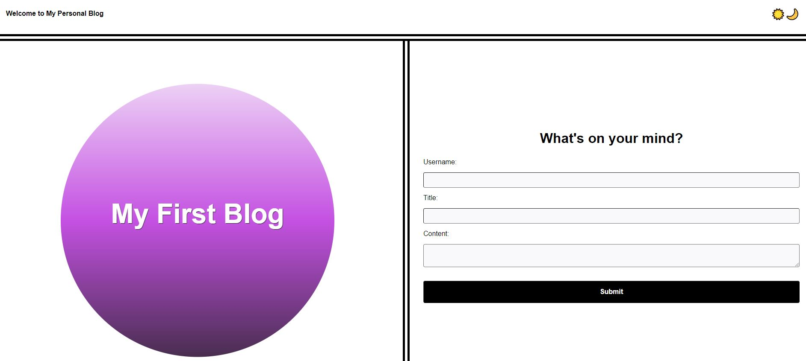

# Personal Blog Project

## Description

This is a personal blog website where users can input and view blog posts. It includes features like a light/dark mode toggle using the sun and moon emojis and data persistence using localStorage. This project is built to provide an easy-to-use interface for users to share their thoughts and experiences.

## User Story

As a student, I want a personal blog so that I can showcase my thoughts and experiences.

## Acceptance Criteria

- **Landing Page:**
  - When the app loads, the user is presented with a form containing labels and inputs for username, blog title, and blog content.
  - When the form is submitted, the blog post data is stored in localStorage.
  - When the form is successfully submitted, the user is redirected to the posts page.
  - If the form is submitted without a username, title, or content, the user is presented with a message prompting them to complete the form.

- **Posts Page:**
  - The user is presented with a header that includes a light mode/dark mode toggle and a "Back" button.
  - When the light mode/dark mode toggle is clicked, the page content's styles update to reflect the selection.
  - When the "Back" button is clicked, the user is redirected back to the landing page to input more blog entries.
  - The main content presents a list of blog posts pulled from localStorage, showing the title, content, and author of each post.
  - The footer contains a link to the developer's portfolio.

## File Structure
my-blog  
├── assets 
│ ├── CSS  
│ │ ├── blog.css  
│ │ ├── form.css  
│ │ └── styles.css  
│ └── js  
│ ├── blog.js  
│ ├── form.js  
│ └── logic.js  
├── index.html  
├── blog.html  
└── README.md  

## Features

- Form for entering blog post details (username, title, content).
- Validation to ensure all fields are filled before submission.
- Blog posts are stored in localStorage.
- List of blog posts displayed on a separate page.
- Light/dark mode toggle.
- Back button to return to the form page

## ScreenShot

## Link

